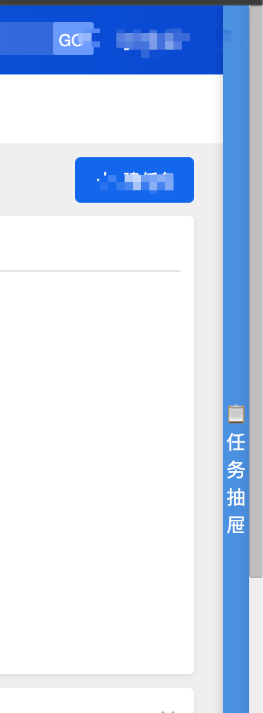
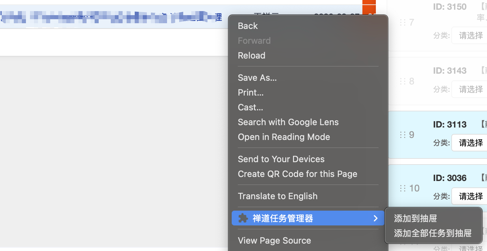
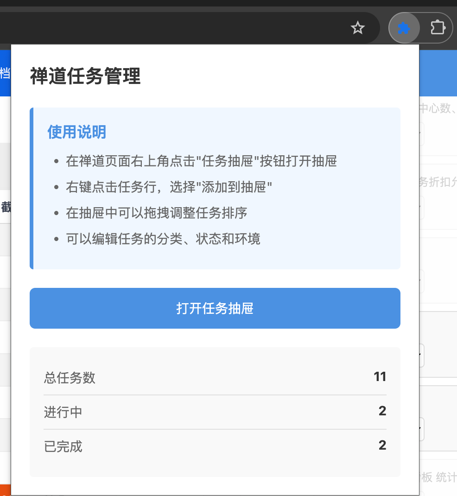

# 禅道任务管理器 Chrome 扩展

## 解决痛点

禅道我的任务是产品发布的，按时间顺序，但是用户没有操作任务的排序、分类、开发状态、发布到哪个环境了，导致每次查看任务时，都要重新识别任务的状态。

## 解决方案

- 浏览器扩展识别禅道任务页面，自动展示抽屉按钮
- 右键菜单快速添加任务，支持单个添加和批量添加
- 任务数据本地持久化存储，关闭浏览器不丢失
- 拖拽排序 + 下拉选择，轻松管理任务状态

## 核心功能

### 1. 智能识别与显示
- 自动识别禅道任务页面（`zentao.tigermed.net`）
- 使用禅道官方图标作为扩展图标
- 页面右侧显示抽屉按钮



### 2. 快速添加任务

#### 单个添加
- 右键点击任务行，选择"添加到抽屉"
- 支持选中文字后添加，也支持直接右键添加

#### 批量添加
- 右键页面任意位置，选择"添加全部任务到抽屉"
- 自动过滤已存在的任务，避免重复



### 3. 任务管理

#### 不可编辑字段
- **ID**: 任务唯一标识（唯一性判断依据）
- **任务名称**: 任务名称
- **任务url**: 任务详情页 url
- **产品**: 任务所属产品

#### 可编辑字段
- **系统**: CCMS、BDS、VISITRACK、HIM、SPAS
- **状态**: 挂起、进行中、已完成
- **环境**: test、uat、prod
- **排序**: 拖拽调整任务顺序

### 4. 数据存储
- 使用 localStorage 本地存储
- 数据持久化，关闭浏览器不丢失
- 根据任务 ID 自动去重

### 5. 统计面板
- 点击扩展图标查看统计
- 显示总任务数、进行中数量、已完成数量



## 安装步骤

### 1. 下载图标文件

```bash
chmod +x download-icon.sh
./download-icon.sh
```

这会自动下载禅道的 favicon 图标。

### 2. 加载扩展到 Chrome

1. 打开 Chrome 浏览器
2. 在地址栏输入 `chrome://extensions/`
3. 打开右上角的"开发者模式"开关
4. 点击"加载已解压的扩展程序"
5. 选择项目文件夹
6. 扩展加载成功！

## 使用方法

### 1. 打开抽屉
- 访问禅道任务页面
- 点击页面右侧的"📋 任务抽屉"按钮

### 2. 添加任务

**单个添加**
- 右键点击任务行 → "添加到抽屉"

**批量添加**
- 右键页面任意位置 → "添加全部任务到抽屉"

### 3. 管理任务

**拖拽排序**
- 按住任务左侧的拖拽手柄（⋮⋮）
- 拖动到目标位置

**修改字段**
- 点击下拉菜单选择分类、状态、环境
- 修改后自动保存

**删除任务**
- 点击任务右上角的删除按钮（×）

### 4. 查看统计
- 点击浏览器工具栏中的扩展图标
- 查看总任务数、进行中、已完成

## 项目结构

```
zentao-chrome-extension/
├── manifest.json          # 扩展配置文件
├── background.js          # 后台脚本，处理右键菜单和消息
├── content.js             # 内容脚本，处理页面交互和抽屉功能
├── content.css            # 抽屉样式（优化后的紧凑布局）
├── popup.html             # 弹出页面 HTML
├── popup.js               # 弹出页面逻辑
├── favicon.ico            # 禅道网站图标
├── download-icon.sh       # 图标下载脚本
├── INSTALL.md             # 详细安装说明
└── README.md              # 项目说明
```

## 数据结构

```json
{
  "id": "123",
  "project": "项目A",
  "href": "https://zentao.tigermed.net/task/view/123.html",
  "user": "张三",
  "sort": 1,
  "system": "CCMS",
  "status": "进行中",
  "env": "test"
}
```

## 技术特点

### 1. 智能任务提取
- 支持从选中任务行空白区域提取任务
- 处理文本节点和元素节点的边界情况

### 2. 实时数据同步
- 修改字段后立即保存
- 自动重新渲染 DOM
- localStorage 持久化存储

### 3. 友好的用户体验
- 紧凑的抽屉布局，一屏显示更多任务
- 抽屉宽度 700px，优化空间利用
- 自动跳过已存在的任务
- 清晰的添加结果提示

### 4. 健壮的错误处理
- 完善的 try-catch 错误捕获
- 详细的调试日志
- DOM 未加载完成的初始化保护

## 技术栈

- Chrome Extension Manifest V3
- Vanilla JavaScript（原生 JavaScript）
- localStorage API
- Context Menus API
- HTML5 Drag and Drop API

## 注意事项

1. **URL 识别**: 扩展只在 `https://zentao.tigermed.net` 页面激活
2. **数据持久化**: 使用 localStorage 存储，清除浏览器数据会丢失
3. **右键菜单**:
   - "添加到抽屉" 在任意位置都显示
   - "添加全部任务到抽屉" 只在页面上下文显示
4. **DOM 依赖**: 数据提取依赖禅道页面的特定 DOM 结构

## 调试方法

1. **内容脚本调试**
   - 在任务页面按 F12 打开开发者工具
   - 查看 Console 标签的日志输出

2. **扩展后台脚本调试**
   - 打开 `chrome://extensions/`
   - 点击扩展的"检查视图" → "service worker"

3. **查看 localStorage 数据**
   - 在开发者工具中执行
   ```javascript
   localStorage.getItem('zentaoTasks')
   ```

## 更新日志

### v1.1.0
- ✨ 新增：批量添加全部任务功能
- ✨ 新增：右键菜单"添加全部任务到抽屉"
- 🔧 优化：抽屉布局紧凑化，一屏显示更多任务
- 🔧 优化：抽屉宽度从 400px 增加到 700px
- 🔧 优化：任务卡片横向排列，减少高度
- 🔧 优化：字段修改后自动重新渲染
- 🔧 优化：使用禅道官方 favicon 作为图标
- 🐛 修复：任务提取时 closest 方法报错
- 🐛 修复：初始化时可能出现的错误
- 💾 改进：数据存储从 chrome.storage 改为 localStorage
- ⚡ 改进：添加 ID 唯一性检查，防止重复添加
- 多次导入全部任务，会更新抽屉list，增加没有的真实的任务，删除抽屉中不存在的真实任务，并更新抽屉中的任务不可变信息